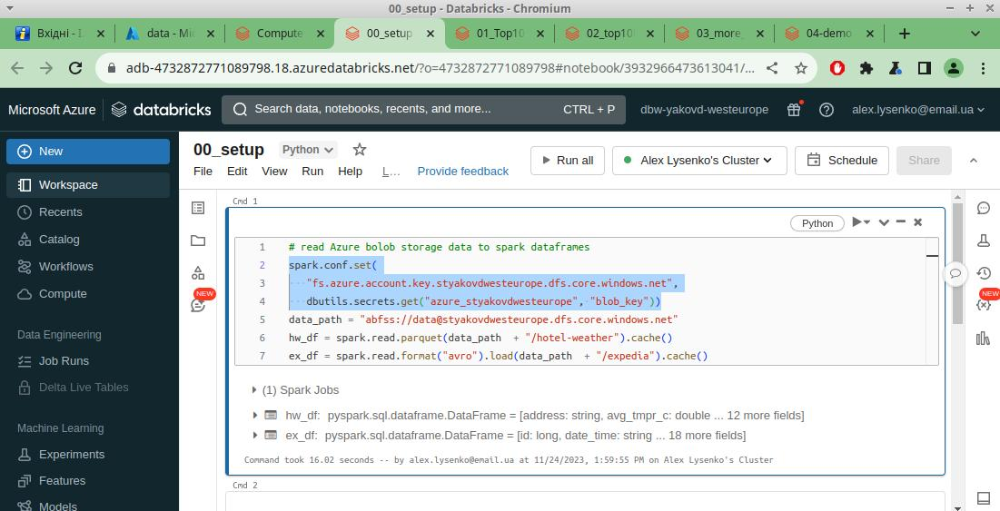

# Spark ETL on Databricks
## 1. Prerequisites
Installed latest:   
- Azure CLI,
- databricks CLI,
- terraform,  
- spark installed to /opt/spark/

Login to Azure:
```
az login
```

## 2. Terraform   
Create Azure Resource Group and Storage Account, get Storage Account key:
```
az group create --name tf-state-rg \
  --location westeurope

az storage account create --name sa451 \
  --location westeurope \
  --resource-group tf-state-rg

az storage account keys list --account-name sa451
```
Use key from abow, create a container so Terraform can store the state management file:
```
az storage container create --account-name sa451 \
  --name tfstate \
  --public-access off \
  --account-key <account-key>
```
## 3. Data
Put your data to the Azure storage account blob container. Now it can be accessible from pyspark console. Just start pyspark this way:
```
pyspark \
  --conf spark.hadoop.fs.azure.account.key.<acc>.dfs.core.windows.net=<key> \
  --packages org.apache.hadoop:hadoop-azure:3.2.0,com.microsoft.azure:azure-storage:8.6.3,org.apache.spark:spark-avro_2.12:3.4.0
```
where:   
**acc** - storage account name,   
**key** - storage account access key.  

You can access the data by such path:  
```
data_path = f"abfs://{container}>@{account}.dfs.core.windows.net"
```
## 4. Local development
To avoid cost spending we can develope notebooks localy in Jupyter notebook. For this we should install Jupyter and use it as spark python driver:
```
pip install jupyter
export PYSPARK_PYTHON=/usr/bin/python3
export PYSPARK_DRIVER_PYTHON='jupyter'
export PYSPARK_DRIVER_PYTHON_OPTS='notebook --port=8889'
```
Now if we run pyspark as described in chater **3.Data** we start pyspark not in console but in Jupyter 


so we can efectively develop notebooks localy.  
SQL sintaxis also alailable in Jupyter. Fo this install sparksql-magic:
```
pip install sparksql-magic
```
then run it in notebook by `%load_ext sparksql_magic` command, so now `%%sparksql` magic comand is available


## 5. Databricks connect to Azure storage
We will use databricks secrets to store Azure storage account access key.
Create secret scope 
`> databricks secrets create-scope <scope-name> --initial-manage-principal users`

add secret
`> databricks secrets put-secret <scope-name> <key-name> --string-value <secret>`

Now you can refer to secret in notebook as
`dbutils.secrets.get(<scope-name>, <key-name>)`

## 6. Run om Databricks
On this stage we have:
- properly set databrics secrets to connect Azure storage
- incoming data in the Azure storage
- developed notebooks with code localy

Next our steps are:
- import notebooks to Databricks workspase


- create and run compute cluster


- uncoment in 00_setup notebook chunck of code needed for using databricks secrets and connect to Azure storage



- run notebooks performing ETLs


- analize execution plans


- check output data in Azure storage


